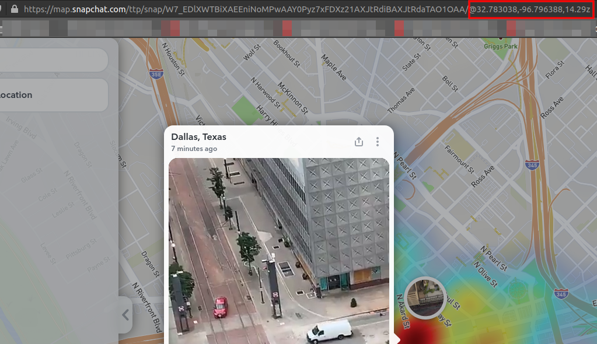

# Snapchat Story Downloader

This program can search Snapchat's public [Snap Map](https://map.snapchat.com/)
at multiple locations and download all stories for later investigation and
categorization. A lot is unknown about how Snapchat decides which videos show
up at which "point" on the map, so the scraper can also randomize the geolocation
where it scrapes from by a few hundred meters to hopefully convince the API
to give you a few more relevant videos.

This has been tested on Linux, but should work on Windows/Mac as well with
a video viewer installed.


## Install Instructions

```bash
git clone https://github.com/nemec/snapchat-map-scraper.git
cd snapchat-map-scraper/
python3 -m venv env  # create virtual environment
source env/bin/activate  # activate virtual environment
pip3 install -r requirements.txt
```


## Usage

Follow each step in order. Also, ensure you have activated your virtual
environment, otherwise the packages will be missing.

### Create Database

This database holds data related to one group of search queries. Since SQLite
produces database files with little overhead, you should create a new database
each time you want to sample data.

```bash
python3 story_downloader.py create snap.db
```

### Add locations

The add command will add a new location to the database. The program will later
scrape and log snaps from all of the added locations so that you can track multiple
spots at once. Find the latitude and longitude of your point of interest (this
can easily be found on Snap Map, as seen below) and replace them in the command
below. The label makes it easier to remember where a point is.

```bash
python3 story_downloader.py add --database snap.db --label "downtown dallas" 32.783038 -96.796388
# Added downtown dallas to database
```



### Scraping media

The scrape command iterates through all of the added locations and downloads
snaps at that location. Previews, videos, and overlays are all downloaded
but the review command can only deal with video at the moment.

Optional arguments:

* `--randomize` will randomize the geo location within 500m, intended to prompt
    Snapchat's API to send new videos that it hasn't yet served. I have no idea
    why Snapchat only sends a subset of the total videos for a single point,
    probably to make the service more scalable.
* `--repeat` will cause the application to loop infinitely looking for new videos.
    Leave it running overnight to collect as much as possible.
* `--sleep` will modify how long the application sleeps before repeating. Defaults
    to 120 seconds and only takes effect if `--repeat` is included.
* A label can also be added as a positional argument to only scrape one location.
    Example: `python3 story_downloader.py scrape "downtown dallas"`

```bash
python3 story_downloader.py scrape --database snap.db --randomize --repeat
# Scraped 16 media from location downtown dallas
# Sleeping for 120 seconds...
```

### Review media

The review command looks through all unreviewed videos and opens each one in
a video player for review. Once you have closed the video player process,
the CLI will prompt you for a "classification". This can be any text describing
the situation in the video or a tag, etc. If the video is irrelevant, leave
the classification blank and just hit "Enter". Once all remaining videos are
classified, the application will exit. Depending on your operating system, 


```bash
python3 story_downloader.py review --database snap.db
# Classify or leave blank: police protesters
# 15 remaining
# Classify or leave blank:
# 14 remaining
# Classify or leave blank: fire
# 13 remaining
# ...
```


### Export media

The export command will copy all videos which are "classified" to a new folder
for further review/editing/publishing.

```bash
python3 story_downloader.py export --database snap.db export/
# 3 video(s) exported
```